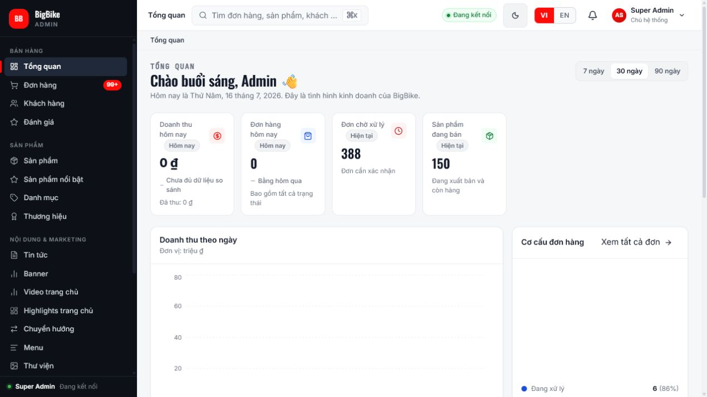
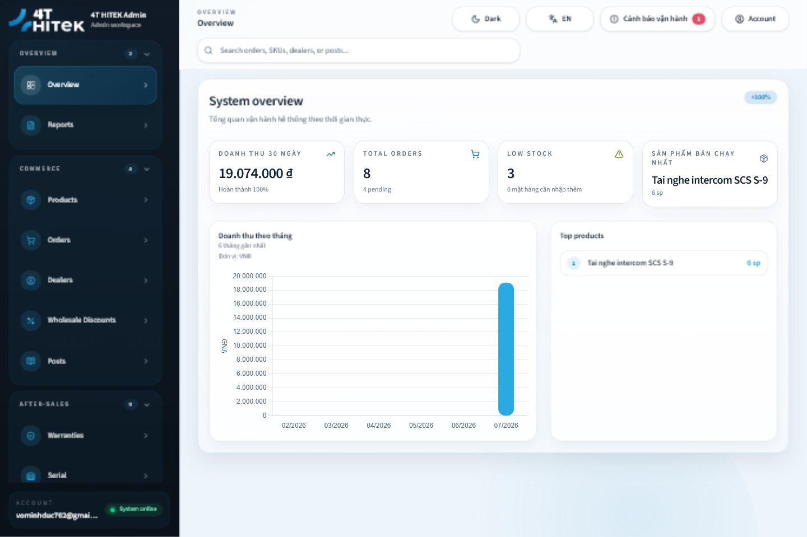
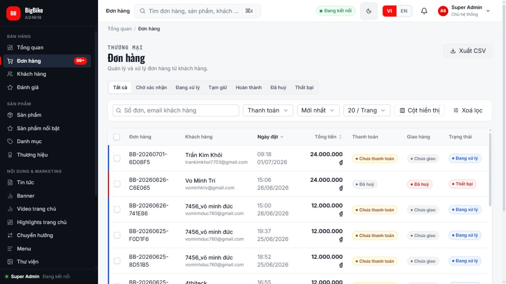
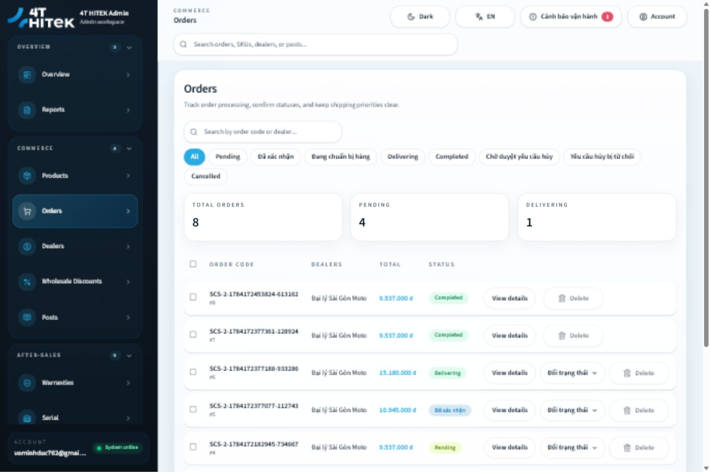
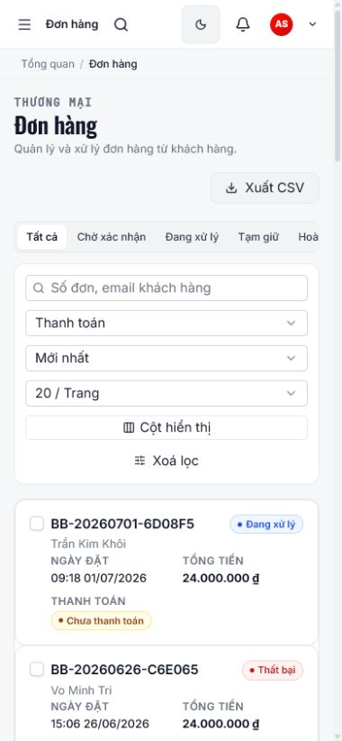
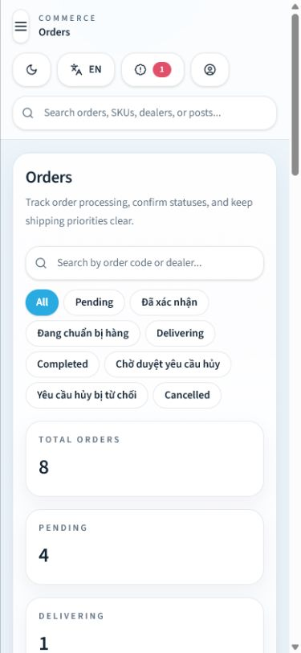

# Audit chéo BigBike ↔ 4thitek — 2026-07-16

> **Loại báo cáo:** audit độc lập, hai chiều, chỉ đọc source + kiểm chứng runtime.  
> **Phạm vi:** `E:\Project\bigbike\bigbike-admin`, `E:\Project\bigbike\bigbike-backend`, `E:\Project\4thitek\admin-fe`, `E:\Project\4thitek\backend` và các tài liệu business/engineering được chỉ định.  
> **Không thực hiện:** không sửa code, không sửa tài liệu nguồn, không lưu dữ liệu nghiệp vụ trong lúc thử UI.

## Executive summary

1. Kiểm kê độc lập xác nhận **31 screen production / 20 mục nav** ở BigBike và **32 page production / 19 mục nav** ở 4thitek; toàn bộ 39 mục nav đã được mở trên app chạy thật.
2. Hai hệ thống không cùng mô hình: BigBike là **B2C bán lẻ**, còn 4thitek là **B2B distributor/dealer**; `Customer`, guest checkout và UGC review của BigBike tuyệt đối không được đổi tên rồi đưa sang 4thitek.
3. BigBike mạnh hơn về chiều sâu catalog/content, taxonomy, media library, audit diff, autosave/recovery và mật độ thao tác; 4thitek mạnh hơn về dealer lifecycle, serial/warranty/return/support, tài chính chuyển khoản và dashboard hướng ngoại lệ vận hành.
4. Hướng BigBike → 4thitek nên ưu tiên **pattern** import dry-run, editor có schema/preview, media governance, audit detail và dirty-state guard; các capability retail đều được gắn rõ **KHÔNG ÁP DỤNG — B2C bị cấm**.
5. Hướng 4thitek → BigBike nên ưu tiên self-account/password, scheduled publishing, permission chi tiết theo hành động và các alert vận hành phù hợp COD; không mang dealer/SePay/settlement sang BigBike chỉ để đạt parity.
6. P0 của 4thitek gồm Blog detail crash, Product Quick Add sai create/route contract, archive/delete Product chưa nhất quán, date range report Warranty/Serial không có hiệu lực và action UI chưa gate đúng permission; policy PublicContent và thuật ngữ receivable được xếp P1.
7. Runtime tái hiện được hai lỗi chặn luồng chính: BigBike vỡ `/admin/products/new`; 4thitek vỡ `/blogs/1`. Cả hai có screenshot thật; 4thitek hiện error code trong ảnh, còn console observation BigBike chưa được lưu thành artifact nên nguyên nhân cần tái xác minh.
8. UI nên học chéo ở mức information hierarchy, responsive, state feedback, keyboard/focus và guard chống mất dữ liệu; **không copy màu, font, radius hay style**, mỗi dự án giữ design token riêng.

## 1. Phương pháp, snapshot và quy ước

### 1.1 Tính độc lập

- Kết luận trong báo cáo này được dựng lại từ route/screen/page hiện tại, API client, controller/service/entity hiện tại, business contract và app chạy thật.
- Hai audit cũ **không được dùng làm evidence hoặc kế thừa kết luận**. Chúng chỉ được liệt kê ở cuối báo cáo để người đọc tự đối chiếu.
- Migration lịch sử chỉ được dùng để loại false positive; một bảng/controller đã bị drop không được tính là feature đang có.

### 1.2 Snapshot và runtime

| Hệ | Source snapshot quan sát | Runtime đã kiểm tra | Dữ liệu |
|---|---|---|---|
| BigBike | commit `53574638`; worktree sạch khi bắt đầu audit | Admin `http://localhost:4000`, backend `http://localhost:8080`; đăng nhập vai trò Super Admin | Có dữ liệu dày: sản phẩm, đơn hàng, khách hàng, content, media; Review là empty-state tự nhiên |
| 4thitek | commit `0b35445` cộng working-tree state đã có sẵn tại thời điểm audit | Admin `http://localhost:4173`, backend `http://localhost:8082`, main FE `http://localhost:3002`; đăng nhập tài khoản full permission | Khi quan sát có 5 sản phẩm, 8 đơn, 3 đại lý, 3 blog, 60 serial, 2 ticket, 7 payment; dữ liệu warranty thay đổi từ 0 thành 1 trong phiên audit |

Ảnh được lưu ở `docs/audits/screenshots/bigbike-4thitek-2026-07-16/`: **79 ảnh** gồm 39 BigBike và 40 4thitek. Kích thước file thuộc hai nhóm desktop khoảng 1265–1440 px ngang và mobile 375–390 px ngang. Dữ liệu local có thể tiếp tục thay đổi sau thời điểm chụp; vì vậy ảnh là evidence theo thời điểm, không phải snapshot DB bất biến.

### 1.3 Cách đếm và phân loại

- **Production screen/page:** file top-level `*Screen.jsx` hoặc `*Page*.tsx`, loại test và component con. Vì vậy số đếm không dùng ước lượng 37/47 trong đề bài.
- **Module vận hành:** một capability có surface FE và/hoặc API/domain riêng; nhiều list/detail/create screen có thể thuộc một module.
- **Đầy đủ:** có surface quản trị + API/domain tương ứng. **Một phần:** có field/khả năng nhưng thiếu workflow riêng. **Nhúng:** subfeature nằm trong page khác. **Backend-only:** không có page quản trị độc lập. **Không có:** không thấy capability hiện hành.
- Verdict: **Áp dụng**, **Áp dụng có điều chỉnh**, **Chỉ học pattern/structure**, **Có điều kiện**, **Không áp dụng**, hoặc **KHÔNG ÁP DỤNG — B2C bị cấm**.
- Ưu tiên: **P0** = sai contract/chặn luồng/nguy cơ dữ liệu; **P1** = giá trị cao nên làm gần; **P2** = roadmap/có điều kiện.

### 1.4 Rào chắn B2B bắt buộc

`E:\Project\4thitek\CLAUDE.md:6-8,19-20,60-69,106-111` xác định 4thitek là B2B, **primary actors** gồm Admin/internal staff, Dealer và System; end-customer không phải account nhưng có thể xuất hiện như dữ liệu phụ trong warranty/public content; đơn mới chỉ `BANK_TRANSFER`; không có dealer credit/debt; và cấm re-introduce customer account, guest checkout, wishlist, POS retail.

> **Quy tắc áp dụng trong toàn báo cáo:** nếu capability BigBike dựa trên khách lẻ, guest hoặc hành vi retail, verdict đối với 4thitek là **KHÔNG ÁP DỤNG — B2C bị cấm**. Một pattern UI tổng quát vẫn có thể học riêng, nhưng không chuyển entity, actor hay workflow.

| Capability retail/B2C | Trạng thái BigBike | Verdict BigBike → 4thitek | Vì sao |
|---|---|---|---|
| Customer account/address/session | Hiện hành | **KHÔNG ÁP DỤNG — B2C bị cấm** | End-customer không phải account trong 4thitek; Dealer là actor khác |
| Guest cart/checkout/order linkage/lookup | Hiện hành | **KHÔNG ÁP DỤNG — B2C bị cấm** | Trái actor model Admin–Dealer–System và Prohibited |
| Public UGC review/moderation | Hiện hành | **KHÔNG ÁP DỤNG — B2C bị cấm** | Support/warranty evidence không được biến thành retail review |
| Retail POS | Đã gỡ khỏi BigBike | **KHÔNG ÁP DỤNG — B2C bị cấm** | Vừa không còn là capability hiện hành, vừa bị cấm rõ ở 4thitek |
| Wishlist | Đã gỡ khỏi BigBike | **KHÔNG ÁP DỤNG — B2C bị cấm** | Không có cơ sở parity hiện hành và bị cấm rõ ở 4thitek |
| Coupon bán lẻ | Đã gỡ khỏi BigBike | **KHÔNG ÁP DỤNG — B2C bị cấm** | Wholesale tier của dealer không phải coupon retail |
| Promotional sale-price/markdown workflow, size guide, suitability, related/accessory upsell | Một phần nằm trong merchandising Product BigBike | **KHÔNG ÁP DỤNG nguyên semantics — B2C bị cấm** | Không cấm base `retailPrice` hợp lệ của 4thitek; chỉ học editor/validation pattern trung tính, còn compatibility/kit B2B phải là domain riêng |
| Top retail customers | Có trong report BigBike | **KHÔNG ÁP DỤNG — B2C bị cấm** | “Top dealers” chỉ được tạo từ yêu cầu/metric B2B riêng, không đổi nhãn metric khách lẻ |

### 1.5 Guardrail: feature lịch sử không còn hiện hành

| Feature | Trạng thái BigBike hiện tại | Cách xử lý trong audit |
|---|---|---|
| POS bán lẻ | Đã gỡ platform-wide (`V265`, online-only) | Không ghi là BigBike-only; tiếp tục không áp dụng cho 4thitek |
| Coupon | Đã gỡ (`V267`) | Không dùng migration cũ để suy ra module đang có |
| Wishlist | Đã gỡ (`V320`) | Không dùng làm đề xuất parity |
| Warranty vận hành | Đã gỡ (`V266`); chỉ còn wording/content marketing | Không coi là tương đương module Warranty 4thitek |
| Return/RMA/refund vận hành | Đã gỡ (`V261`) | Chỉ mở lại khi owner quyết định một after-sales roadmap B2C mới |
| Quantity inventory | BigBike hiện chỉ có cờ availability, không trừ/hoàn kho | Không âm thầm nhập serial/quantity model từ 4thitek |
| Serial platform | Đã gỡ (`V259`) | Không suy entity/migration lịch sử thành capability hiện hành |
| Shipping admin | Đã gỡ (`V264`); chỉ còn legacy snapshot cần cho đơn cũ | Không ghi là module vận hành hiện tại |
| Static Pages/Guide builder | Đã gỡ (`V271`) | Không khôi phục page builder chỉ để parity với PublicContent |
| Stock receipt/movement workflow | Receipt schema drop ở `V120`; quantity movement/writer dừng ở `V261`; `StockMovementEntity`/repository còn dormant | Contract hiện hành vẫn là boolean availability, không quantity ledger |
| AR/credit sale | Đã gỡ (`V263`) | Không dùng schema lịch sử để suy ra công nợ/credit hiện hành |

## 2. Bảng module/feature hai chiều

### 2.1 Ma trận đầy đủ

| Module / feature | BigBike (FE → BE/domain) | 4thitek (FE → BE/domain) | Phân loại | BigBike → 4thitek | 4thitek → BigBike | Lý do chính |
|---|---|---|---|---|---|---|
| Admin login/session | `LoginScreen`, `AcceptInviteScreen` → `AuthController`, invite/JWT | Login/forgot/reset/verify → `AuthController`; đổi mật khẩu → `AdminStaffUserController` | Cả hai, khác sâu | **Áp dụng có điều chỉnh P1:** hiển thị rõ invite expiry/resend/pending lifecycle | **Áp dụng P1:** self-account view, đổi/quên/reset mật khẩu cho mọi admin | BigBike mạnh invite; 4thitek mạnh password self-service |
| Profile cá nhân | Không có route riêng; đổi thông tin/mật khẩu nằm trong Admin Users và phụ thuộc quyền | `/profile` là self-account view đọc từ session/AuthContext; `/change-password` là self-service, chưa có edit-profile API | Chỉ 4thitek | — | **Áp dụng P1:** self-account view + change password; edit profile là scope riêng nếu cần | Admin BigBike không nên cần quyền quản trị user để tự xem account/đổi mật khẩu |
| Email verification riêng | Invite acceptance chứng minh email, không có verification route riêng | `/verify-email`, resend verification | Chỉ 4thitek | — | **Có điều kiện P2** | Chỉ cần nếu BigBike cho tạo account ngoài invite |
| Dashboard | Analytics 7/30/90 ngày, recent orders, top products, order mix | KPI/delta 30 ngày, trend 6 tháng, low stock, top product và operational alerts | Cả hai, khác trọng tâm | **Áp dụng P1:** giữ delta/trend hiện có, thêm period switcher và recent-order drill-down | **Áp dụng có điều chỉnh P1:** exception-first cho pending payment/unfulfilled B2C; không copy SePay/dealer settlement | BigBike linh hoạt kỳ xem hơn; 4thitek đã có trend và thiên ngoại lệ vận hành |
| Orders | List/detail, notes, audit timeline, payment và fulfillment tách, allowed transitions | State machine B2B, serial assignment, carrier/tracking, payments, adjustments, cancellation settlement; có detail endpoint nhưng page vẫn resolve từ shared context | Cả hai, khác domain | **Áp dụng P1:** wire existing detail endpoint/client vào `OrderDetailPage`, thêm notes/audit timeline và permission-aware actions | **Áp dụng có điều chỉnh P1:** granular action permissions; chỉ học append-only/audit cho event BigBike đã có, không nhập Adjustment/Settlement/serial/SePay | Cùng noun nhưng actor, payment và state machine khác |
| Customer account/list/detail | `CustomerList/Detail`; Customer, Address, session; backend guest-order linking | Không có Customer actor/domain hiện hành | Chỉ BigBike | **KHÔNG ÁP DỤNG — B2C bị cấm** | — | Dealer không phải tên thay thế của khách lẻ |
| Guest checkout / public order lookup | Backend checkout guest, cart/session và order lookup | Không có | Chỉ BigBike, backend/public | **KHÔNG ÁP DỤNG — B2C bị cấm** | — | Trái actor model và mục Prohibited |
| Dealer lifecycle | Không có | Dealer list/detail, status, sales policy, onboarding/account lifecycle | Chỉ 4thitek | — | **Không áp dụng** | Đây là lõi B2B, không phải Customer admin B2C |
| Product review UGC | Review list/detail/moderation + public review | Không có public UGC review | Chỉ BigBike | **KHÔNG ÁP DỤNG — B2C bị cấm** | — | Ticket, warranty evidence hay dealer feedback không được biến thành retail review |
| Product core | Taxonomy, brand, i18n/SEO, structured blocks, variants, preview, trash/recovery | Concrete SKU, live preview, block descriptions/specs/videos, dirty tracking, warranty period, quantity/serial link | Cả hai, khác sâu | **P0/P1:** sửa Quick Add SKU/route contract và canonical trash; wire FE vào paged endpoint hiện có + thêm server query/filter, import dry-run và schema/i18n/SEO sâu hơn | **Có điều kiện P2:** serial/warranty chỉ nếu BigBike mở roadmap hàng serialized | 4thitek đã có preview/block authoring và backend paging; gap chính là create/data lifecycle, FE scale và metadata |
| Product category tree | Hierarchy, i18n/SEO/banner, trash/restore, hard-delete impact preview và subtree/product reassignment về `uncategorized` | Không có product category; `/admin/categories` trong backend là **blog category** | Chỉ BigBike | **Có điều kiện P1:** taxonomy B2B khi catalog tăng; nếu làm phải có reference-impact/reassignment, không CRUD-delete ngây thơ; không copy facet/gender retail | — | Cần tránh false parity giữa product taxonomy và `CategoryBlog` |
| Brand manager | i18n/SEO/logo/banner, trash/restore, hard-delete impact và product reassignment về `uncategorized-brand` | Product không có brand module/entity tương ứng | Chỉ BigBike | **Có điều kiện P2:** chỉ khi roadmap đa thương hiệu; học reference-impact/reassignment | — | 4thitek hiện tập trung SCS |
| Attributes/variants | Nhúng sâu trong Product editor; controller/entity riêng | Mỗi Product là một concrete SKU | Chỉ BigBike về workflow variant | **Có điều kiện P2:** chỉ khi có orderable combinations; serial/stock vẫn bám concrete SKU | — | Không copy promotional markdown, size guide hay retail suitability; base `retailPrice` 4thitek vẫn hợp lệ |
| Featured/homepage products | Màn riêng, slot limit, order, drag-and-drop, undo | Field `isFeatured`/`showOnHomepage`, chưa có ordering/slot editor | Cả hai; 4thitek một phần | **Áp dụng P1:** order/slot/preview | Không có gap material lớn | 4thitek không thiếu hoàn toàn, chỉ thiếu workflow merchandising |
| Product import/export | JSON `ProductImportRow[]` validate/dry-run/commit + full JSON export cùng top-level shape; import luôn DRAFT và cố ý bỏ publish/media/relation groups | Export CSV client-side từ dữ liệu đã tải; chưa có import contract tương đương | Chỉ BigBike về import engine | **Áp dụng P1:** staged validation/per-row result và upsert identity theo SKU/slug; 4thitek phải quyết định rõ media/status/relations | — | Không gọi là idempotency/round-trip tuyệt đối; giá trị chính là validate trước commit và contract server |
| Availability / quantity inventory | Backend summary + cờ Còn/Hết; không quantity movement | Quantity, low-stock, serial inventory | Cả hai nhưng semantics khác | **Giữ quantity/serial; không đơn giản hóa theo BigBike** | **Không áp dụng hiện tại**; chỉ alert phù hợp boolean availability | Không tạo parity giả giữa boolean và tồn kho định lượng |
| Wholesale quantity discount | Không có discount hiện hành | Tier theo số lượng cho dealer | Chỉ 4thitek | — | **Không áp dụng trực tiếp**; P2 chỉ khi BigBike xác nhận volume-pricing B2C mới | Dealer pricing không phải coupon retail |
| Article/blog | Article list/detail/create, bilingual SEO, trash/recovery, autosave/live preview | Blog list/detail, scheduling, block editor, preview, homepage toggle | Cả hai, khác sâu | **Áp dụng P1:** archive/recovery, server paging, autosave, i18n/SEO | **Áp dụng P1:** scheduled publish và homepage toggle | Hai hướng đều có pattern đáng học |
| Public content/CMS | Nhiều editor chuyên biệt; page builder chung đã gỡ | `/settings/content` quản lý home/about/contact/policy/certification/reseller bằng JSON | Cả hai, khác kiến trúc | **Áp dụng P1:** schema-driven form, preview và dirty guard thay raw JSON | **Chỉ học pattern hợp nhất contract P2**, không khôi phục page builder đã gỡ chỉ để parity | 4thitek không phải “trắng CMS”; thiếu editor typed, không thiếu dữ liệu public content |
| Slider/carousel | `SliderListScreen` + reorder/status/link | Không có collection slider chuyên biệt | Chỉ BigBike | **Có điều kiện P2:** chỉ lấy schema/order/asset/link validation nếu marketing cần | — | Không copy retail promotion semantics |
| Home video | `HomeVideoListScreen` + API/entity | Hero video public hiện chủ yếu code-defined | Chỉ BigBike | **Có điều kiện P2:** editor asset nếu content team cần; giữ fallback/reduced-motion riêng | — | Nhu cầu vận hành phải được xác nhận |
| Home highlights | `HomeHighlightsScreen`: 3 slot chọn Product; category chỉ derived từ `product.category` | Không có taxonomy product tương ứng | Chỉ BigBike | **Chưa áp dụng**; xem lại sau taxonomy B2B | — | Phụ thuộc category tree |
| Page hero/banner | `BannerScreen` nhúng Settings, typed setting registry | Home/public JSON và hero code-defined, chưa có typed hero editor tương đương | BigBike chuyên biệt hơn | **Chỉ học pattern P2:** typed schema + preview | — | Không copy visual style retail |
| Contextual ownership/help guide | `AssignmentRolesScreen` nhúng Settings, sửa 1–6 role/task description trong `SiteSettingEntity`; guide hiển thị chung ở Product + Content qua `AdminProductAssignmentController` | Không có panel tương đương | Chỉ BigBike | **Chỉ học pattern P2** nếu editor cần giải thích ownership; không tạo assignment entity/workflow và không thay fixed-role governance | — | Đây là contextual help cấu hình được, không phải task assignment |
| Menu manager | `MenuScreen`, item tree/link/category | Public nav code-defined | Chỉ BigBike | **Có điều kiện P2:** chỉ khi content team thực sự cần đổi nav | — | Code-defined nav an toàn hơn nếu thay đổi hiếm |
| Redirect manager | `RedirectListScreen`, loop/open-redirect/hit-count validation; tự tạo redirect VI/EN khi Product/Category/Brand đổi slug | Redirect/canonical chủ yếu code-defined | Chỉ BigBike | **Có điều kiện P2:** chỉ cần registry/auto-slug redirect khi 4thitek cho sửa public slug hoặc marketing thường đổi URL | — | Phải giữ loop detection, destination allowlist và locale mapping |
| Media library | Folder/tag/bulk, trash/restore, replace, reference count | Upload session/finalize, ownership, linked evidence và orphan/status; `QUARANTINED` hiện chỉ là enum/filter placeholder, chưa thấy scanner/service set state | Cả hai, khác sâu | **Áp dụng P1:** folder/bulk/restore/reference-safe delete và scope filter rõ; chỉ giữ quarantine khi có scanning thật | **Áp dụng P1:** upload-session/finalize, ownership/link state | Hai bên bổ sung nhau tốt, không vướng B2C/B2B |
| Warranty operations | Đã gỡ; chỉ còn marketing wording | Registration/lookup/admin lifecycle | Chỉ 4thitek hiện hành | — | **Không hiện tại; có điều kiện P2** nếu owner mở lại after-sales B2C đầy đủ | Không phải parity defect của BigBike |
| Serial + QR + RMA | Đã gỡ serial platform-wide | Import, lifecycle, assignment, QR/RMA | Chỉ 4thitek | — | **Không hiện tại; có điều kiện P2** | Phụ thuộc warranty/return và hàng serialized thật |
| Return request | Đã gỡ return/RMA/refund | Aggregate list/detail/state/actions | Chỉ 4thitek | — | **Không hiện tại; có điều kiện P2** | Cần state machine/refund COD B2C mới trước khi code |
| Support tickets | Không có module ticket | Dealer ticket, thread, attachments, assignment/internal notes | Chỉ 4thitek | — | **Áp dụng có điều chỉnh P2:** Customer/Guest/Order, không dùng Dealer semantics | Chỉ đáng làm khi khối lượng CSKH cần workflow riêng |
| Admin operational notification | Bell/inbox cá nhân, server-persisted read state, WebSocket order events | Topbar operational alerts + realtime; read IDs localStorage | Cả hai, khác sâu | **Áp dụng P1:** persist read-state theo account/server | **Áp dụng P1:** full history/deep-link nếu có nhu cầu | Không đồng nhất với outbound marketing |
| Outbound notification composer | Không có broadcast customer | Full dispatch/history tới Dealer/Account | Chỉ 4thitek | — | **Chỉ học pattern P2** nếu có consent/segmentation B2C; không copy audience Dealer | Marketing B2C cần consent/unsubscribe riêng |
| Recent bank payments | Không có; checkout COD | `/payments/recent` | Chỉ 4thitek | — | **Không áp dụng** | Không có bank-reconciliation use case tương ứng |
| Unmatched payment / settlement / adjustment | Không có hiện hành; SePay artifacts đã gỡ ở `V59`, return/refund/RMA workflow đã gỡ ở `V261` | `/unmatched-payments`, `/financial-settlements`, order adjustments | Chỉ 4thitek | — | **Không áp dụng trực tiếp**; P2 chỉ nếu payment model BigBike đổi | Đây là đối soát chuyển khoản B2B, không phải dealer debt ledger |
| Reports | Interactive trends/comparison/top product-customer + CSV | XLSX/PDF Order/Revenue/Warranty/Serial | Cả hai, khác sâu | **Chỉ học pattern P1:** period/trend và DB-side filter. **KHÔNG ÁP DỤNG — B2C bị cấm** đối với entity/metric top retail customers; top dealers phải được định nghĩa độc lập từ yêu cầu B2B | **Chỉ học export pattern P2**; không copy top dealer/debt semantics | BigBike sâu phân tích; 4thitek sâu file giao vận/hậu mãi |
| Staff/admin users | Invite/resend/status/role + privilege guards | Create onboarding link/status/reset; fixed staff roles | Cả hai, khác sâu | **Áp dụng P1:** role reassignment trong fixed catalog + lifecycle rõ | **Áp dụng P1:** reset-by-link/self-service | Custom roles chưa có requirement/contract 4thitek hiện tại; chỉ mở rộng sau owner/SoD review |
| Roles/permissions | Custom role editor + permission matrix; order write còn coarse | Fixed role catalog hiện tại, 24 permission codes, SoD theo transition | Cả hai, khác policy | **Không đề xuất custom-role parity hiện tại**; giữ fixed catalog trừ khi owner/SoD requirement yêu cầu mở rộng; P1 thêm read-only matrix/diff/confirm | **Áp dụng P1:** granular order/action permissions | Fixed catalog là implementation hiện tại, không phải hệ quả bắt buộc của B2B |
| Audit logs | Filter, enriched labels, before/after diff drawer, danger markers, CSV | List/card; entity có payload JSON nhưng DTO/UI chưa expose detail | Cả hai | **Áp dụng P1:** scrubbed payload/diff/entity link/export | **Có thể học request context P2** | BigBike sâu hơn về điều tra sự cố |
| Settings | Typed registry, masking, dirty count, autosave/recovery, hero/assignment tabs | Typed operational config, secret replacement, VAT, email test, rate limit, SePay | Cả hai, khác domain | **Áp dụng P1:** dirty guard/recovery/typed public-content | **Áp dụng P1:** validation effective config, test integration và secret replacement; không copy SePay | Pattern settings có thể học, key nghiệp vụ thì không |
| Global search | Ctrl/Cmd+K, server/API fan-out Order/Product/Customer | `/`, tìm nav + order/product/dealer/blog/discount/user từ context đã tải | Cả hai | **Áp dụng P1:** server lightweight/capped, thêm serial/warranty/return/ticket theo permission | **Áp dụng P1:** mở rộng content/media/review hợp lệ và giữ permission gate | 4thitek phủ domain rộng hơn nhưng tải/index client nặng |

## 3. Module có ở cả hai: cải thiện cụ thể

| Module | BigBike đang mạnh | 4thitek đang mạnh | Cải thiện BigBike | Cải thiện 4thitek | Ưu tiên |
|---|---|---|---|---|---|
| Auth/account | Invite lifecycle, lock/audit | Forgot/reset/verify, read-only self-account view, self-service change password | Tạo self-account/change-password cho mọi admin; reset bằng link thay vì admin nhập hộ mật khẩu | Hiển thị invite expiry/resend/pending lifecycle rõ; edit profile chỉ thêm nếu có nhu cầu | P1 hai bên |
| Dashboard | Period 7/30/90, comparison, recent/top | Delta 30 ngày, trend 6 tháng, exception cards stale/shipping/payment/stock | Thêm exception B2C hợp lệ như payment pending/unfulfilled; không SePay/dealer settlement | Giữ delta/trend hiện có; thêm period switcher và recent-order drilldown | P1 |
| Orders | Notes, audit timeline, allowed transitions, payment/fulfillment tách | Serial, carrier/tracking, payment history, adjustment, cancellation settlement; có detail API chưa được detail page dùng | Tách permission approve/process/cancel/payment/fulfillment; giữ domain COD | Wire detail page vào endpoint/client hiện có; thêm notes/audit timeline, guard draft payment; gate action theo permission | 4thitek P0/P1; BigBike P1 |
| Products | Taxonomy, brand, i18n/SEO, variants, preview, import, trash | Concrete SKU, live preview, block authoring, dirty tracking, warranty/serial/quantity | Chỉ cân nhắc serial/warranty khi business mở lại | Sửa Quick Add thiếu SKU + navigate nhầm ID, rồi canonical archive/trash; wire FE vào `/admin/products/page` và thêm server query/filter; import dry-run; metadata/i18n/SEO sâu hơn | 4thitek P0/P1 |
| Featured | Màn riêng, order/limit/DnD/undo | Field tích hợp ngay Product | Không gap material | Thêm order/slot limit/preview; giữ field flag làm input | 4thitek P1 |
| Blog/content | Trash/recovery, bilingual SEO, autosave/live preview | Scheduling, block editor, homepage toggle | Scheduled publishing với timezone/audit rõ | Trash/recovery, server paging, autosave/recovery, SEO/i18n | P1 hai bên |
| Media | Library, folders/tags, bulk, restore, replace/reference | Upload lifecycle, owner/link/orphan; quarantine mới là placeholder enum/filter | Upload session/finalize + ownership/link-state | Full category filter, upload queue, folder/bulk/restore/reference-safe delete; không quảng bá quarantine trước khi có scanning | P1 hai bên |
| Reports | Interactive analysis, prior-period, CSV | XLSX/PDF theo nghiệp vụ B2B | Thêm XLSX/PDF chỉ khi có nhu cầu in/chia sẻ | DB-side date filter/cap và on-screen period/trend; metric top-dealer chỉ tạo từ yêu cầu B2B độc lập, không chuyển top-customer metric | 4thitek P0/P1; BigBike P2 |
| Settings | Typed registry, dirty tabs, autosave/recovery | Operational cards, secret mask/replacement, email test | Effective-config validation/test flow; rà lại CONTACT/PAYMENT definitions đang bị `HIDDEN_GROUPS` ẩn để có edit path hoặc retire rõ | Schema form + preview cho PublicContent; central dirty guard | P1 |
| Staff/RBAC | Invite/status/custom role UI | Fixed role + SoD granular | Fine-grained order permission; self-account view/change password | Permission-aware actions, fixed-role matrix/reassignment; sửa role hint sai | 4thitek P0/P1; BigBike P1 |
| Audit | Diff/detail/danger/export | Có payload/entity backend và request context | Bổ sung method/path/user-agent nếu chưa hiển thị | Expose payload đã scrub, diff/detail/link/export | 4thitek P1 |
| Notifications | Inbox cá nhân server-side + WebSocket | Dispatch/history/deep-link | Full history/search chỉ khi cần; broadcast B2C phải có consent | Persist read state per account; tách operational inbox khỏi dispatch | P1/P2 |
| Global search | Keyboard palette và query backend có giới hạn | Phủ nhiều domain B2B | Mở rộng Content/Media/Review theo quyền | Server search capped + Serial/Warranty/Return/Ticket theo permission; Finance chỉ khi có nhu cầu rõ và gate `orders.payment.confirm` | P1 |

## 4. Phát hiện ưu tiên

### 4.1 P0 — cần xử lý trước

| Hệ | Phát hiện | Evidence | Tác động | Khuyến nghị |
|---|---|---|---|---|
| BigBike | `/admin/products/new` vỡ ngay khi render editor | Runtime: `BB-22-product-create-desktop.png`. Console trong phiên audit có cảnh báo Tiptap editor-view/duplicate extension, nhưng không được lưu thành artifact nên nguyên nhân cần tái xác minh | Không tạo được sản phẩm từ route chính | Reproduce với source map/log lưu được, kiểm tra lifecycle editor/extension registration, thêm smoke test route create |
| 4thitek | `/blogs/1` vỡ với React minified error #310 | Runtime: `4T-24-blog-detail-desktop.png`, route error boundary | Không sửa/xem chi tiết blog | Sửa hook/render ordering trong `BlogDetailPageRevamp`, thêm test route với record thật |
| 4thitek | Product Quick Add chắc chắn vi phạm create/route identifier contract | `ProductsPage.tsx:206-215` gửi name/price/description nhưng không SKU và navigate bằng `created.id`; `AdminWriteSupport.java:32-35` bắt SKU; detail route/lookup dùng `:sku` | Request tạo nhận 400; kể cả tạo được thì chuyển tới URL ID không match SKU | Thêm field/generator SKU theo contract, navigate bằng `created.sku`, test integration Quick Add → detail |
| 4thitek | Product archive/restore/permanent-delete không có contract server nhất quán | FE archive/restore PUT `isDeleted=true/false`; backend list chỉ `isDeleted=false`; DELETE cũng chỉ set `isDeleted=true`; FE gọi “xóa vĩnh viễn”. Backend còn có `PublishStatus.ARCHIVED` nhưng FE type chỉ dùng `DRAFT` / `PUBLISHED` | Record archive biến khỏi nguồn list nên restore không đáng tin cậy; hai mô hình archive/trash chồng nhau | Chọn canonical `PublishStatus.ARCHIVED` hoặc `isDeleted`/trash, rồi đồng bộ list/restore/permanent-delete/FE/docs và test vòng đời |
| 4thitek | Date range report được trình bày dùng chung nhưng Warranty/Serial backend bỏ qua | `ReportsPageRevamp`, `AdminReportingService` các nhánh Warranty/Serial | File xuất không khớp filter người dùng chọn | Truyền và áp dụng `from/to`, hoặc ẩn/disable range trên report không hỗ trợ |
| 4thitek | UI action không gate theo permission | Page không dùng `hasPermission` cho các cặp read→write/action: Orders (`approve/process/cancel/payment`), Dealer (`read/write`), Warranty (`read/write`), Serial (`read/write/assign`), Return (`read/write`), Support (`read/write`); Notifications route `read` nhưng POST chỉ ADMIN/SUPER_ADMIN | User thấy action rồi nhận 403; sai affordance và khó audit, dù backend vẫn chặn | Gate từng action theo cùng permission backend; bổ sung `notifications.write` hoặc thống nhất role policy |

### 4.2 P1 — giá trị cao

- **4thitek:** central unsaved-change guard; wire Product FE vào paged endpoint + server query/filter; import dry-run; Product/Blog trash recovery; schema-driven PublicContent; media scope/category; audit diff; server-side notification read state; fixed-role matrix; semantic/accessibility cleanup. `/settings/content` hiện SuperAdmin-only đúng với route policy trong Permission Matrix, trong khi backend `content.write`/seed CONTENT_EDITOR tạo cross-layer inconsistency; cần chọn canonical policy thay vì mặc định coi route gate là bug. Thuật ngữ “dư nợ/Xóa nợ” có thể hợp lệ cho outstanding/write-off từng đơn, nhưng nên đổi thành “còn phải thu/xóa sổ phần còn phải thu theo đơn” nếu muốn tránh bị hiểu thành dealer debt ledger. `OrderDetailPage` còn render cùng `outstandingAmount` hai lần dưới “Còn lại” và “Remaining balance”; hợp nhất thành một field.
- **Docs-first 4thitek:** `API_CONTRACT.md` và `PERMISSION_MATRIX.md` vẫn có chỗ dẫn `AdminController.java` không còn tồn tại sau khi backend tách thành 13 `Admin*Controller`. `STATE_MACHINES.md` lại gán `PublishStatus` cho PublicContent dù entity dùng Boolean `published`, và bỏ `QUARANTINED` trong khi code còn enum/filter. Cập nhật traceability/state contract ở mức P1.
- **BigBike:** self-account view + change/forgot/reset password; fine-grained order permissions; scheduled publishing; exception-first dashboard phù hợp B2C; media upload-session/finalize; settings integration validation/test. Sửa permission mismatch của contextual guide: Content route chỉ cần `content.read` nhưng `/admin/product-assignment` cần `products.read`, khiến role content-only mở editor được nhưng banner help lỗi; endpoint/help read phải chấp nhận đúng consumer permission hoặc tách contract.
- **Cả hai:** thống nhất keyboard save, phản hồi validation/toast, focus restore, reduced-motion và test route chính có dữ liệu.

### 4.3 P2 — chỉ khi roadmap xác nhận

- **4thitek:** product category/brand/variants, slider/video/menu/redirect/typed hero editor.
- **BigBike:** serial/warranty/return/support workflow B2C, XLSX/PDF reports, outbound customer messaging có consent.

## 5. Audit UI/UX trên app chạy thật

### 5.1 Tổng quan evidence

- Desktop: mở đủ **20/20** nav BigBike và **19/19** nav 4thitek.
- Nested/form: Product create/detail, Order detail, Customer/Dealer detail, Category/Brand/Content/Blog, PublicContent/Profile, Support/Payment detail.
- State: loading, empty, lỗi data-not-found và hai runtime crash thật.
- Responsive: dashboard, list/table/card, long form, media/settings, navigation drawer ở 375–390 px.
- Micro-interaction: Ctrl/Cmd+K hoặc `/`, ArrowDown, Escape, dirty navigation, save shortcut.
- Không intercept request để tạo lỗi; các error-state not-found dùng URL không tồn tại, còn hai crash là lỗi runtime tái hiện tự nhiên.

### 5.2 Dashboard và information hierarchy

**BigBike:** sidebar hẹp, bảng màu tối/đỏ, KPI và period switcher nén tốt; information density cao và đường vào Orders/Products rõ. Phần chart lớn nhưng dữ liệu kỳ hiện tại rỗng làm diện tích trắng nhiều.

**4thitek:** nhóm nav thành card, dashboard thoáng, KPI/exception dễ quét và brand hierarchy rõ; đổi lại sidebar rộng và khoảng trắng lớn làm ít dữ liệu hơn trên một viewport.

**Học chéo:** 4thitek nên học mật độ và drill-down của BigBike; BigBike nên học exception-first summary của 4thitek. Chỉ học cấu trúc, giữ token/màu/font riêng.

### 5.3 List/table và responsive

BigBike đặt filter, cột và nhiều row trong một viewport, phù hợp xử lý khối lượng lớn. 4thitek ưu tiên summary card và action button lớn, dễ đọc nhưng cần cuộn nhiều hơn. Ở desktop, Product 4thitek cũng thiên card thay vì data table nên hiệu suất so sánh SKU giảm khi catalog lớn.

Cả hai thực sự chuyển sang card trên mobile. BigBike đưa record lên sớm hơn và giữ metadata quan trọng trong card; 4thitek đặt ba KPI card cao trước danh sách nên người vận hành phải cuộn xa mới tới đơn. 4thitek nên collapse KPI hoặc cho phép “jump to records” trên mobile; BigBike nên xử lý tab ngang/toolbar để không tạo cảm giác bị cắt.

### 5.4 Loading, empty và error

| State | BigBike runtime | 4thitek runtime | Đánh giá |
|---|---|---|---|
| Loading | Media skeleton: `BB-15-media-desktop.png`, bản loaded: `BB-30-media-loaded-desktop.png` | Route fallback: `4T-30-loading-route-fallback.png` | BigBike có skeleton gắn layout rõ hơn; 4thitek nên tránh khung quá trống và giữ hình dạng trang |
| Empty | Review: `BB-04-reviews-empty-desktop.png` | Discount/Warranty/Media/Return: `4T-06`, `4T-08`, `4T-12`, `4T-13` | Cả hai có title + explanation; 4thitek đẹp nhưng quá cao, BigBike giữ context/filter tốt hơn |
| Not found | Product: `BB-29-error-product-not-found-desktop.png` | Order: `4T-27-error-order-not-found-desktop.png` | Có thông báo rõ nhưng nên thêm action quay lại list và correlation/error code khi phù hợp |
| Runtime crash | Product create: `BB-22-product-create-desktop.png` | Blog detail: `4T-24-blog-detail-desktop.png` | Error boundary ngăn trắng màn hình; 4thitek lộ technical details production-style, nên chỉ hiện mã lỗi và log chi tiết ở telemetry |

Lưu ý: `4T-08-warranties-empty-desktop.png` là empty-state đúng tại thời điểm chụp; sau đó dữ liệu local có thêm một warranty nên `4T-M07-warranties-mobile.png` hiển thị record. Đây là drift dữ liệu, không mâu thuẫn evidence.

### 5.5 Điều hướng và micro-interaction

| Kiểm tra | BigBike | 4thitek | Khuyến nghị |
|---|---|---|---|
| Mobile drawer | Mở/đóng, Escape và trả focus về nút menu hoạt động; nav dày nhưng hiệu quả | Mở/đóng, Escape và trả focus hoạt động; group card rõ nhưng drawer rất dài | Giữ pattern riêng; thêm scroll affordance và `inert/aria-hidden` cho drawer đóng ở 4thitek |
| Global search | Ctrl/Cmd+K mở dialog, focus combobox; ArrowDown chọn kết quả | `/`/search mở list, ArrowDown hoạt động; Escape trả về input | BB cần focus restore rõ về trigger; 4T nên chuyển index từ context toàn bộ sang server capped |
| Dirty navigation | Sửa Brand rồi click Orders bật confirm; dismiss giữ nguyên route | Sửa Product create rồi click Orders: chuyển route ngay, draft mất, không confirm | 4thitek P1: central router guard cho Link/sidebar/back; BigBike bổ sung browser Back/popstate |
| Save shortcut | Source dùng shortcut khác nhau theo page (`Ctrl+S` hoặc `Ctrl+Enter`). Thử blank Content create khi form chưa dirty là **inconclusive** vì handler không chạy ở clean state | Product create không wire `useSaveShortcut`; ảnh vẫn có inline guidance. Hook chỉ xuất hiện ở một số Blog/Dealer/Product detail/Settings | Chuẩn hóa Ctrl/Cmd+S trên các form thực sự cần; test bằng dirty-invalid state, chặn browser Save, focus lỗi đầu, toast/inline summary và aria-live |
| Toast/snackbar | Có ở nhiều mutation, nhưng không đồng đều trên shortcut/no-op | Có ở mutation chính, nhưng error/validation và localization chưa đồng đều | Dùng một contract feedback chung: pending/success/error + retry + correlation id |

Ảnh tương tác: `BB-31-global-search-keyboard-desktop.png`, `4T-31-global-search-keyboard-desktop.png`, `BB-32-save-shortcut-validation-desktop.png`, `4T-32-save-shortcut-validation-desktop.png`, `BB-M07-navigation-drawer-mobile.png`, `4T-M08-navigation-drawer-mobile.png`.

### 5.6 Accessibility cơ bản

Đây là kiểm tra cơ bản, **không phải chứng nhận WCAG**.

| Vấn đề | Hệ/evidence | Cải thiện cụ thể |
|---|---|---|
| Contrast màu primary với chữ trắng | 4thitek `#29abe2` khoảng 2.62:1; BigBike `#FF0C09` khoảng 3.96:1; đều dưới 4.5:1 cho chữ thường | Dùng tone đậm hơn cho button/text hoặc chữ tối; giữ hue/token identity riêng |
| Rich-editor placeholder/affordance phụ nhạt | BigBike dùng `#adb5bd` khoảng 2.08:1 cho Tiptap empty placeholder và một số drag/empty icon; input/textarea thường dùng token đậm hơn | Tăng contrast cho hướng dẫn/affordance có ý nghĩa, không dùng placeholder làm label duy nhất |
| Drawer đóng vẫn có thể focus off-screen | 4thitek source không đặt `inert/aria-hidden` nhất quán | Khi đóng: unmount hoặc `inert`, `aria-hidden`; giữ focus trap khi mở |
| Clickable row chứa link/button lồng nhau | Cả hai có pattern row-click; 4thitek có `role=button` trên `tr` với control con | Chỉ một interactive target chính; bỏ role button khỏi row hoặc dùng link overlay an toàn |
| Status badge bị announce quá nhiều | 4thitek gán `role=status` cho nhiều badge tĩnh | Chỉ dùng live region cho thay đổi động, badge tĩnh là text thường |
| Heading semantics không đều | Một số detail/page 4thitek không có `h1` runtime | Mỗi route một `h1` rõ, heading không nhảy cấp |
| Empty/background refetch | Empty state chưa announce; refetch error có thể ẩn stale-data context | `aria-live=polite`, giữ stale data và banner “không cập nhật được” |
| Reduced motion | Cả hai chưa phủ đầy đủ | Tôn trọng `prefers-reduced-motion` cho drawer, toast, skeleton/transition |
| Chart/table alternative | BigBike report chart thiếu accessible group/summary ở vài view | Thêm textual summary, table thay thế và label cho series/period |

### 5.7 Điểm mạnh nên học, theo đúng mức

| Pattern tốt | Bên nên học | Mức áp dụng | Giới hạn |
|---|---|---|---|
| Filter/table dày, column visibility, URL state | 4thitek | P1 cho Orders/Product/Audit | Không copy red theme/typography |
| Mobile card đưa record lên sớm | 4thitek | P1 | Giữ summary B2B nhưng collapse trên mobile |
| Central dirty guard + autosave/recovery | 4thitek | P1 cho form dài | Không lưu secret; key theo user/entity/schema version |
| Typed CMS editor, live preview, media picker | 4thitek | P1 | Chỉ chuyển structure; content vẫn B2B |
| Audit diff/danger markers | 4thitek | P1 | Scrub secret/PII trước khi expose payload |
| Upload-session/finalize + ownership/link lifecycle | BigBike | P1 | `QUARANTINED` chỉ được xem là capability khi có scanner/service thật sự set state |
| Account self-service | BigBike | P1 | Không làm yếu invite/lock/audit hiện có |
| Exception-first dashboard | BigBike | P1 | Dùng exception COD/B2C, không dealer/SePay |
| Scheduled publishing | BigBike | P1 | Timezone, scheduler, audit rõ |
| Permission chi tiết theo order action | BigBike | P1 | Map sang state machine BigBike, không copy trạng thái B2B |

## 6. Mô tả và manifest screenshot

Tất cả tên file/path tương đối dưới đây được resolve từ thư mục ảnh đã nêu ở §1.2; ảnh được chụp từ app thật, role full permission, không dùng màn hình trắng làm evidence thành công.

### 6.1 Toàn bộ nav chính BigBike — 20/20

| # | Route | Screenshot | Ghi chú |
|---:|---|---|---|
| 1 | `/admin/dashboard` | `BB-01-dashboard-desktop.png` | KPI, period, chart/order mix |
| 2 | `/admin/orders` | `BB-02-orders-desktop.png` | Dense table, filters, CSV |
| 3 | `/admin/customers` | `BB-03-customers-desktop.png` | B2C customer list |
| 4 | `/admin/reviews` | `BB-04-reviews-empty-desktop.png` | Empty-state tự nhiên |
| 5 | `/admin/products` | `BB-05-products-desktop.png` | Catalog table |
| 6 | `/admin/featured-products` | `BB-06-featured-products-desktop.png` | Ordering/slots |
| 7 | `/admin/categories` | `BB-07-categories-desktop.png` | Product taxonomy |
| 8 | `/admin/brands` | `BB-08-brands-desktop.png` | Brand manager |
| 9 | `/admin/content` | `BB-09-content-desktop.png` | Article list |
| 10 | `/admin/sliders` | `BB-10-sliders-desktop.png` | Slider collection |
| 11 | `/admin/home-videos` | `BB-11-home-videos-desktop.png` | Home video manager |
| 12 | `/admin/home-highlights` | `BB-12-home-highlights-desktop.png` | Highlight slots |
| 13 | `/admin/redirects` | `BB-13-redirects-desktop.png` | Redirect registry |
| 14 | `/admin/menus` | `BB-14-menus-desktop.png` | Menu tree |
| 15 | `/admin/media` | `BB-15-media-desktop.png`, `BB-30-media-loaded-desktop.png` | Loading skeleton và loaded library |
| 16 | `/admin/reports` | `BB-16-reports-desktop.png` | Interactive analytics |
| 17 | `/admin/settings` | `BB-17-settings-desktop.png` | Typed settings + embedded tabs |
| 18 | `/admin/admin-users` | `BB-18-admin-users-desktop.png` | Invite/status/role |
| 19 | `/admin/roles` | `BB-19-roles-desktop.png` | Custom role matrix |
| 20 | `/admin/audit-logs` | `BB-20-audit-logs-desktop.png` | Filter/diff entry points |

### 6.2 Toàn bộ nav chính 4thitek — 19/19

| # | Route | Screenshot | Ghi chú |
|---:|---|---|---|
| 1 | `/` | `4T-01-dashboard-desktop.png` | KPI/trend/top product |
| 2 | `/reports` | `4T-02-reports-desktop.png` | XLSX/PDF exports |
| 3 | `/products` | `4T-03-products-desktop.png` | Product cards/list |
| 4 | `/orders` | `4T-04-orders-desktop.png` | Status/KPI/actions |
| 5 | `/dealers` | `4T-05-dealers-desktop.png` | B2B dealer list |
| 6 | `/discounts` | `4T-06-discounts-empty-desktop.png` | Empty wholesale tier |
| 7 | `/blogs` | `4T-07-blogs-desktop.png` | Blog list |
| 8 | `/warranties` | `4T-08-warranties-empty-desktop.png` | Empty tại thời điểm chụp |
| 9 | `/serials` | `4T-09-serials-desktop.png` | Serial inventory/import |
| 10 | `/notifications` | `4T-10-notifications-desktop.png` | Composer/history |
| 11 | `/support-tickets` | `4T-11-support-tickets-desktop.png` | Ticket queue |
| 12 | `/media` | `4T-12-media-empty-desktop.png` | Empty media state |
| 13 | `/returns` | `4T-13-returns-empty-desktop.png` | Empty return queue |
| 14 | `/payments/recent` | `4T-14-recent-payments-desktop.png` | Recent bank payments |
| 15 | `/unmatched-payments` | `4T-15-unmatched-payments-desktop.png` | Reconciliation queue |
| 16 | `/financial-settlements` | `4T-16-financial-settlements-desktop.png` | Cancellation/stale settlement |
| 17 | `/users` | `4T-17-users-desktop.png` | Staff accounts |
| 18 | `/audit-logs` | `4T-18-audit-logs-desktop.png` | Audit list |
| 19 | `/settings` | `4T-19-settings-desktop.png` | Security/VAT/notification/SePay/email/rate limit |

### 6.3 Nested route, form và state evidence BigBike

| Screenshot | Route/state | Mô tả quan trọng |
|---|---|---|
| `BB-21-product-detail-desktop.png` | `/admin/products/:id` | Editor dài, taxonomy/variant/content/SEO và sticky action bar |
| `BB-22-product-create-desktop.png` | `/admin/products/new` | Runtime crash trước khi form dùng được |
| `BB-23-order-detail-desktop.png` | `/admin/orders/:id` | Payment/fulfillment, notes, timeline/audit |
| `BB-24-customer-detail-desktop.png` | `/admin/customers/:id` | Hồ sơ khách B2C và lịch sử đơn |
| `BB-25-category-detail-desktop.png` | `/admin/categories/:id` | Taxonomy editor + product assignment |
| `BB-26-brand-detail-desktop.png` | `/admin/brands/:id` | Brand editor; dùng để thử dirty guard |
| `BB-27-content-detail-desktop.png` | `/admin/content/article/:id` | Article editor, SEO/preview/autosave |
| `BB-28-content-create-desktop.png` | `/admin/content/articles/new` | Form create |
| `BB-29-error-product-not-found-desktop.png` | Product ID không tồn tại | Error-state API tự nhiên |
| `BB-30-media-loaded-desktop.png` | `/admin/media` sau load | Folder/library/asset actions |
| `BB-31-global-search-keyboard-desktop.png` | Ctrl/Cmd+K + query + ArrowDown | Keyboard search hoạt động |
| `BB-32-save-shortcut-validation-desktop.png` | Clean blank Content create + Ctrl+Enter | No-op ở clean state; phép thử **không đủ** để kết luận validation/shortcut hỏng |

### 6.4 Nested route, form và state evidence 4thitek

| Screenshot | Route/state | Mô tả quan trọng |
|---|---|---|
| `4T-20-product-detail-desktop.png` | `/products/:sku` | Concrete SKU, specs/video/warranty/serial context |
| `4T-21-product-create-desktop.png` | `/products/new` | Form create nhiều tab; dùng để thử mất draft |
| `4T-22-order-detail-desktop.png` | `/orders/:id` | State actions, serial, payment/adjustment/shipping |
| `4T-23-dealer-detail-desktop.png` | `/dealers/:id` | Dealer lifecycle và business profile |
| `4T-24-blog-detail-desktop.png` | `/blogs/1` | Runtime crash React #310 |
| `4T-25-public-content-desktop.png` | `/settings/content` | Public-content JSON editor; thiếu schema form/preview |
| `4T-26-profile-desktop.png` | `/profile` | Self-service account |
| `4T-27-error-order-not-found-desktop.png` | Order ID không tồn tại | Error-state API tự nhiên |
| `4T-28-support-detail-desktop.png` | Ticket detail trong `/support-tickets` | Thread/attachment/internal operation |
| `4T-29-payment-master-detail-desktop.png` | Payment master-detail | Đối soát giao dịch theo đơn |
| `4T-30-loading-route-fallback.png` | Lazy route ngay sau navigation | Loading fallback |
| `4T-31-global-search-keyboard-desktop.png` | Search + query + ArrowDown | Keyboard search hoạt động |
| `4T-32-save-shortcut-validation-desktop.png` | Blank Product create + Ctrl+S | Product create không đăng ký save-shortcut hook; inline guidance vẫn hiện, không phải evidence validation bị mất |

### 6.5 Responsive sampling

| Hệ | Screenshot | Archetype |
|---|---|---|
| BigBike | `BB-M01-dashboard-mobile.png` | Dashboard |
| BigBike | `BB-M02-orders-mobile.png` | List → record cards |
| BigBike | `BB-M03-products-mobile.png` | Catalog list/cards |
| BigBike | `BB-M04-media-mobile.png` | Media/library |
| BigBike | `BB-M05-settings-mobile.png` | Settings/form |
| BigBike | `BB-M06-product-detail-mobile.png` | Long product form + sticky actions |
| BigBike | `BB-M07-navigation-drawer-mobile.png` | Navigation drawer mở |
| 4thitek | `4T-M01-dashboard-mobile.png` | Dashboard |
| 4thitek | `4T-M02-orders-mobile.png` | KPI + list/cards |
| 4thitek | `4T-M03-products-mobile.png` | Product cards |
| 4thitek | `4T-M04-serials-mobile.png` | Data-heavy serial workflow |
| 4thitek | `4T-M05-support-mobile.png` | Ticket queue |
| 4thitek | `4T-M06-settings-mobile.png` | Settings/cards |
| 4thitek | `4T-M07-warranties-mobile.png` | Warranty record sau data drift |
| 4thitek | `4T-M08-navigation-drawer-mobile.png` | Navigation drawer mở |

## 7. Inventory source BigBike: 31 screen → route → backend/entity

Đường dẫn gốc: `E:\Project\bigbike`. Bảng này liệt kê đủ 31 file production top-level trong `bigbike-admin/src/screens/`; component con không được đếm lại.

| Screen production | Route/surface | Controller/service chính | Entity/aggregate chính |
|---|---|---|---|
| `LoginScreen.jsx`, `AcceptInviteScreen.jsx` | Public login, `/accept-invite` | `api/auth/AuthController`, `AdminAuthService` | `AdminUserEntity`, `AdminRoleEntity`, `AdminRefreshTokenEntity`, `AdminInviteTokenEntity` |
| `DashboardScreen.jsx` | `/admin/dashboard` | `AdminDashboardController`, `AdminInventoryController`, dashboard/inventory services | `OrderEntity`, `OrderLineItemEntity`, `ProductEntity`, `ProductVariantEntity` aggregates |
| `OrderListScreen.jsx`, `OrderDetailScreen.jsx` | `/admin/orders`, `/admin/orders/:id` | `AdminOrderController`, `AdminOrderService` | `OrderEntity`, `OrderLineItemEntity`, `PaymentEntity`, `OrderNoteEntity`, `OrderAddressEntity`, `AuditLogEntity`; `OrderShippingItemEntity` là legacy snapshot vẫn được detail đọc, còn fee item là importer-only |
| `CustomerListScreen.jsx`, `CustomerDetailScreen.jsx` | `/admin/customers`, `/:id` | `AdminCustomerController`, `AdminCustomerService` | `CustomerEntity`, `CustomerAddressEntity`, `OrderEntity` |
| `ReviewListScreen.jsx`, `ReviewDetailScreen.jsx` | `/admin/reviews`, `/:id` | `AdminReviewController`, `AdminReviewService` | `ReviewEntity`, `ProductEntity` |
| `ProductListScreen.jsx`, `ProductDetailScreen.jsx` | `/admin/products`, `/new`, `/:id` | `AdminCatalogController`, `AdminAttributeController`, `AdminProductImportController`; `AdminCatalogReadService`, `ProductMutationService`, `ProductImportService` | `ProductEntity`, `ProductVariantEntity`, variant option/gallery, `AttributeEntity`, `AttributeValueEntity`, `CategoryEntity`, `BrandEntity` |
| `FeaturedProductsScreen.jsx` | `/admin/featured-products` | `AdminCatalogController`, `HomepageBlockMutationService` | `ProductEntity` |
| `CategoryListScreen.jsx`, `CategoryDetailScreen.jsx` | `/admin/categories`, `/new`, `/:id` | `AdminCatalogController`; `AdminCatalogReadService`, `CategoryMutationService`, `CategoryDeletionImpactService` | `CategoryEntity`, `ProductEntity` |
| `BrandListScreen.jsx`, `BrandDetailScreen.jsx` | `/admin/brands`, `/new`, `/:id` | `AdminCatalogController`; `AdminCatalogReadService`, `BrandMutationService` | `BrandEntity`, `ProductEntity` |
| `ContentListScreen.jsx`, `ContentDetailScreen.jsx` | `/admin/content`, `/articles/new`, `/article/:id` | `AdminContentController`, `AdminContentReadService`, `AdminContentMutationService` | `ArticleEntity`; `ContentCategoryEntity` default `tin-tuc` được auto-resolve, picker/reference endpoint đã gỡ |
| `SliderListScreen.jsx` | `/admin/sliders` | `AdminSliderController`, `AdminSliderService` | `SliderEntity`, optional `ProductEntity` link |
| `HomeVideoListScreen.jsx` | `/admin/home-videos` | `AdminHomeVideoController`, `AdminHomeVideoService` | `HomeVideoEntity` |
| `HomeHighlightsScreen.jsx` | `/admin/home-highlights` | `AdminHomeHighlightsController`, `HomeHighlightsService` | `HomeHighlightEntity`, `ProductEntity` |
| `RedirectListScreen.jsx` | `/admin/redirects` | `AdminRedirectController`, `AdminRedirectService` | `RedirectEntity` |
| `MenuScreen.jsx` | `/admin/menus` | `AdminMenuController`, `AdminMenuService` | `MenuEntity`, `MenuItemEntity`, `CategoryEntity` |
| `MediaLibraryScreen.jsx` | `/admin/media` | `AdminMediaController`, `AdminMediaFolderController`, media services | `MediaEntity`, `MediaFolderEntity` |
| `ReportsScreen.jsx` | `/admin/reports` | `AdminReportController`, `AdminReportService` | Aggregate `OrderEntity`, `OrderLineItemEntity`, `CustomerEntity`, `ProductEntity` |
| `SettingsScreen.jsx`, `BannerScreen.jsx`, `AssignmentRolesScreen.jsx` | `/admin/settings`; Banner và Assignment là tab **nhúng** | `AdminSettingsController`, `AdminProductAssignmentController` | `SiteSettingEntity`; PUBLIC_HERO/PRODUCT_ASSIGN có editor nhúng, còn CONTACT/PAYMENT definitions/public consumers vẫn tồn tại nhưng group bị UI ẩn |
| `AdminUsersScreen.jsx` | `/admin/admin-users` | `AdminAdminUsersController`, user/auth services | `AdminUserEntity`, `AdminRoleEntity`, invite/refresh entities |
| `RolesScreen.jsx` | `/admin/roles` | `AdminRolesController`, `AdminPermissionsController`, role/permission services | `AdminRoleEntity`, `AdminUserEntity`; permission catalog code-defined/persisted theo contract |
| `AuditLogListScreen.jsx` | `/admin/audit-logs` | `AdminAuditLogController`, `AdminAuditLogService` | `AuditLogEntity` |

### 7.1 Capability active ngoài nav/screen độc lập

| Capability | FE surface | Backend/domain | Kết luận |
|---|---|---|---|
| Admin notification bell | App shell, không có nav page | `AdminNotificationController/Service`; `AdminNotificationEntity`, `AdminNotificationReadEntity`; WebSocket order events | Active, server-persisted read state per admin |
| Global admin search | App shell/command palette | Fan-out các admin list/search API Order/Product/Customer | Active; nên mở rộng permission-safe |
| Inventory summary | Dashboard/backend, không có nav module movement | `AdminInventoryController/Service`; Product/Variant availability | Backend/aggregate only; không đồng nghĩa quantity inventory |
| Attributes/variants | Nhúng Product editor | `AdminAttributeController`; attribute/variant entities | Active subfeature, không phải nav module |
| Guest/customer commerce | Public web/API, không phải admin page độc lập | Cart/Checkout/Customer/Order controllers và entities | Active B2C backend; **không áp dụng cho 4thitek** |

## 8. Inventory source 4thitek: 32 page → route → backend/entity

Đường dẫn gốc: `E:\Project\4thitek`. Bảng này liệt kê đủ 32 file production top-level trong `admin-fe/src/pages/`; `/reset` là alias của `/reset-password` nên 32 page tạo ra 33 URL concrete.

| Page production | Route/surface | Controller/service chính | Entity/aggregate chính |
|---|---|---|---|
| `LoginPage.tsx`, `ForgotPasswordPage.tsx`, `ResetPasswordPage.tsx`, `VerifyEmailPage.tsx` | `/login`, `/forgot-password`, `/reset-password`, `/reset`, `/verify-email` | `AuthController`, `AuthService`, password/email verification services | `Account`, `Admin`, `Role`, `Permission`, `RefreshTokenSession`, `PasswordResetToken`, `EmailVerificationToken`; Dealer auth là surface khác, không phải các admin page này |
| `ChangePasswordPage.tsx` | `/change-password` | `AdminStaffUserController` `PATCH /admin/password`, `AdminManagementService` | `Admin`, `Account`; AuthContext cập nhật client session flag |
| `ProfilePage.tsx` | `/profile` | Đọc identity hiện tại từ AuthContext/session; không có edit-profile API riêng | `Account`, `Admin` read model |
| `DashboardPageRevamp.tsx` | `/` | `AdminMiscController`, `DashboardService` | Aggregate `Product`, `Order`, `Dealer`, `Blog`, `Admin`, `BulkDiscount`, `FinancialSettlement`, `UnmatchedPayment` |
| `ReportsPageRevamp.tsx` | `/reports` | `AdminMiscController`, `AdminReportingService` | Aggregate `Order`, `BulkDiscount`, `WarrantyRegistration`, `ProductSerial` và VAT/settings/snapshot data; không đọc `Payment` repository trực tiếp |
| `ProductsPage.tsx`, `CreateProductPage.tsx`, `ProductDetailPage.tsx` | `/products`, `/products/new`, `/products/:sku` | `AdminProductController`, `AdminManagementService`, preview/public/media services | `Product`, `ProductSerial`, `MediaAsset` |
| `OrdersPageRevamp.tsx`, `OrderDetailPage.tsx` | `/orders`, `/orders/:id` | `AdminOrderController`, `AdminManagementService`; financial actions qua `AdminFinancialController`, `AdminFinancialService` | `Order`, `OrderItem`, `Payment`, `OrderAdjustment`, `FinancialSettlement`, `ProductSerial`, `Dealer`, `BulkDiscount` |
| `DealersPageRevamp.tsx`, `DealerDetailPage.tsx` | `/dealers`, `/dealers/:id` | `AdminDealerAccountController`, dealer lifecycle/profile services | `Dealer`, `Account`, `Role`, `Order` |
| `WholesaleDiscountsPageRevamp.tsx` | `/discounts` | `AdminDiscountRuleController`, `AdminManagementService` | `BulkDiscount` |
| `BlogsPageRevamp.tsx`, `BlogDetailPageRevamp.tsx` | `/blogs`, `/blogs/:id` | `AdminMiscController` cho blog CRUD/preview; `AdminProductController GET /categories` chỉ là supporting taxonomy; `AdminManagementService`, `PublicBlogService`, media service | `Blog`, `CategoryBlog`, `MediaAsset` |
| `WarrantiesPageRevamp.tsx` | `/warranties` | `AdminWarrantyController`, `AdminOperationsService` | `WarrantyRegistration`, `ProductSerial`, `Product`, `Dealer` |
| `SerialsPageRevamp.tsx` | `/serials` | `AdminSerialController`, management/operations/RMA services | `ProductSerial`, `Product`, `Dealer`, `Order`, `WarrantyRegistration`, `ReturnRequestItem` |
| `NotificationsPageRevamp.tsx` | `/notifications` | Notification endpoints trong `AdminMiscController`, notification/push services | `Notify`, `Account`, `PushDeviceToken` |
| `SupportTicketsPageRevamp.tsx` | `/support-tickets`; detail trong cùng surface | `AdminSupportTicketController`, operations/media services | `DealerSupportTicket`, `SupportTicketMessage`, attachment entities, `Dealer`, `Admin`, `MediaAsset` |
| `MediaLibraryPage.tsx` | `/media` | `AdminMediaController`, `MediaController`, `MediaAssetService` | `MediaAsset` |
| `ReturnsPageRevamp.tsx`, `ReturnDetailPage.tsx` | `/returns`, `/returns/:id` | `AdminReturnController`, return/RMA/financial services | `ReturnRequest`, item/event/attachment entities, `Order`, `Dealer`, `WarrantyRegistration`, `DealerSupportTicket`, `MediaAsset`, `OrderAdjustment`, `ProductSerial` |
| `RecentPaymentsPageRevamp.tsx`, `UnmatchedPaymentsPageRevamp.tsx`, `FinancialSettlementsPageRevamp.tsx` | `/payments/recent`, `/unmatched-payments`, `/financial-settlements` | `AdminFinancialController`, `AdminFinancialService` | `Payment`, `UnmatchedPayment`, `FinancialSettlement`, `Order`, `BulkDiscount`; `OrderAdjustment` thuộc Order detail, không phải ba page này |
| `UsersPageRevamp.tsx` | `/users` | `AdminStaffUserController`, `AdminManagementService` | `Admin`, `Account`, `Role`, `Permission`, password/verification/session tokens |
| `AuditLogsPage.tsx` | `/audit-logs` | Audit endpoints trong `AdminSettingsController`, `AuditLogService`/aspect | `AuditLog` |
| `SettingsPage.tsx` | `/settings` | `AdminSettingsController`, `AdminSettingsService`, `MailService` cho test email | `AdminSettings` |
| `PublicContentPage.tsx` | `/settings/content` | Content endpoints trong `AdminMiscController`, `PublicContentService` | `PublicContentEntry` |

### 8.1 Route/nav không được đánh đồng

- `/admin/categories` được nhắc trong backend 4thitek là **blog category**, không phải product category manager và không có page nav riêng tương đương BigBike.
- Notifications 4thitek là full dispatch/history page; notification bell BigBike là operational inbox. Chúng chỉ cùng vùng concern, không parity một-một.
- `Dealer` 4thitek và `Customer` BigBike là hai actor khác nhau. Mọi mapping đổi tên trực tiếp đều sai business model.
- PublicContent 4thitek đã là CMS generic; thiếu hiện tại là typed authoring/preview, không phải “không có CMS”.

## 9. Traceability và evidence source chính

### 9.1 BigBike

- Route/nav/permission: `E:\Project\bigbike\bigbike-admin\src\App.jsx`.
- 31 screen: `E:\Project\bigbike\bigbike-admin\src\screens\`.
- Module hiện hành và feature đã gỡ: `docs/business/MODULE_CATALOG.md`, `WORKFLOW_OVERVIEW.md`, `STATE_MACHINES.md`.
- API/data/permission: `docs/engineering/API_CONTRACT.md`, `DATA_CONTRACT.md`, `PERMISSION_MATRIX.md`.
- Admin controllers: `bigbike-backend/src/main/java/com/bigbike/bigbike_backend/api/admin/` và `api/auth/AuthController.java`.
- Runtime defect Product create: screenshot `BB-22-product-create-desktop.png`; console trong phiên audit gợi ý Tiptap lifecycle/duplicate extension nhưng không có artifact log riêng, nên nguyên nhân vẫn cần tái xác minh.

### 9.2 4thitek

- Business boundary: `E:\Project\4thitek\CLAUDE.md`, `BUSINESS_LOGIC.md`.
- State/data/API/permission: `docs/business/STATE_MACHINES.md`, `docs/engineering/DATA_CONTRACT.md`, `API_CONTRACT.md`, `PERMISSION_MATRIX.md`.
- Route gates: `admin-fe/src/App.tsx`; nav/search/shell: `admin-fe/src/layouts/AppLayoutRevamp.tsx`.
- 32 page: `admin-fe/src/pages/`.
- Admin controllers: `backend/src/main/java/com/devwonder/backend/controller/Admin*Controller.java` và `AuthController.java`.
- Product lifecycle: `backend/.../service/AdminManagementService.java`.
- Report filtering: `backend/.../service/AdminReportingService.java`.
- Runtime defect Blog detail: screenshot `4T-24-blog-detail-desktop.png` và console trong phiên audit.

### 9.3 Giới hạn

- Không chạy mutation destructive, không save form audit và không thay đổi trạng thái đơn/payment/serial/warranty/return.
- Ảnh là artifact nội bộ từ dữ liệu local/sample; một số ảnh Customer/Dealer hiển thị **đầy đủ** email, điện thoại, địa chỉ hoặc mã số thuế và sidebar 4thitek có email tài khoản đăng nhập. Bộ ảnh chưa được redact, chỉ được lưu trong workspace; phải redact/crop trước khi phát hành ra ngoài nhóm có quyền truy cập dữ liệu.
- Không đăng nhập bằng mọi role; permission mismatch được trace từ route/page/controller/docs và kiểm chứng affordance với tài khoản full permission, không phải role matrix runtime đầy đủ.
- Mobile là sampling theo archetype, không phải 59 route × mọi breakpoint. Desktop nav coverage là đầy đủ.
- Contrast được tính từ token/màu source; chưa phải scan WCAG tự động toàn bộ DOM.
- Performance nhận xét về client-side full-context/search là source-backed; không phải benchmark tải production.

## 10. Kết luận quyết định

### Nên làm trước cho 4thitek

1. Sửa các blocker/contract Product–Blog: Blog detail crash, Product Quick Add thiếu SKU/navigate nhầm ID và archive/delete lifecycle.
2. Sửa report Warranty/Serial date range, wording receivable và permission-aware actions/routes.
3. Chuyển list/search nặng sang server, thêm Product import dry-run.
4. Thêm central dirty guard, schema-driven PublicContent, audit diff và server notification read state.
5. Chỉ sau đó mới cân nhắc category/brand/variant/slider/video/menu/redirect theo roadmap B2B.

### Nên làm trước cho BigBike

1. Sửa Product create crash.
2. Thêm self-account view + change/forgot/reset password và granular order action permissions.
3. Thêm scheduled publishing, operational exception cards phù hợp B2C và media upload lifecycle.
4. Chuẩn hóa dirty guard cho Back/popstate, save shortcut, focus/contrast/reduced-motion.
5. Không khôi phục serial/warranty/return/support/finance chỉ để giống 4thitek; cần quyết định business B2C mới.

### Quyết định bảo vệ mô hình 4thitek

Các capability BigBike sau **không được đưa sang 4thitek**: Customer account/admin, guest checkout/order linkage, public UGC review, retail POS, wishlist, coupon retail, retail upsell/size-guide/suitability và top retail customers. Nếu một interaction pattern hữu ích, chỉ học pattern UI trung tính; entity, actor, permission, metric và state machine vẫn phải là B2B Dealer/System.

## Tài liệu liên quan

Hai file sau chỉ được liệt kê để người đọc tự đối chiếu; **không phải evidence và không được dùng để kế thừa kết luận của audit này**:

- `docs/audits/FOURTHITEK_BIGBIKE_FEATURE_ADOPTION_AUDIT.md`
- `docs/audits/BIGBIKE_ADMIN_PARITY_2026-07-10.md`
